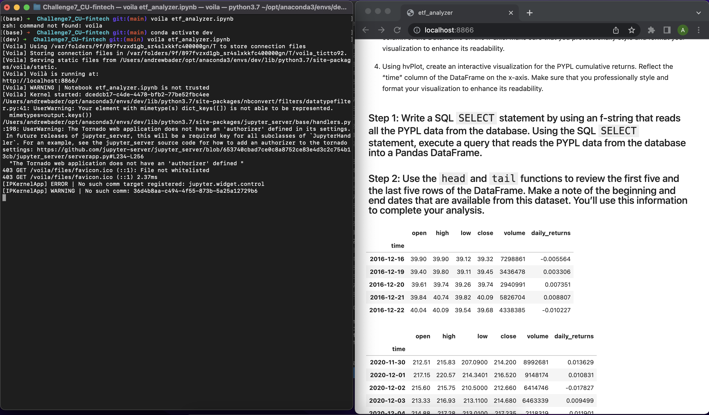

# Challenge7_CU-fintech
Challenge 7 Module 7 CU Fintech Bootcamp

# Project Title

ETF portfolio analysis application

---

## Technologies

This project uses the Python with Jupyter notebook, pandas, numpy, SQL, hvplot and Voila

---

## Installation Guide

To clone and use:
1) make a local directory for this github repository
2) clone down this repo with git clone command
3) cd into cloned repo
4) install pandas, SQL alchemy, and hvplot dependencies
5) run in Jupyter notebook
6) run voila in the conda dev environment to see this notebooks output as a webpage on local host

---

## Use
with the voila library you can see this on local host as a web page

## Contributor

Andrew Ryan Bader

---

## License

N/A